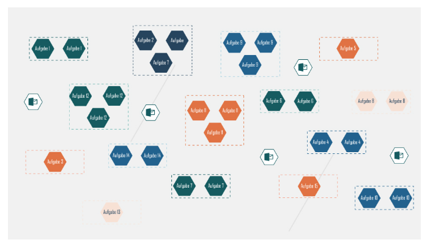
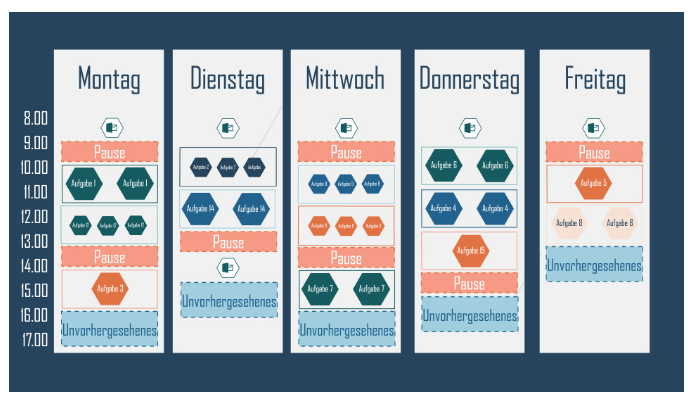
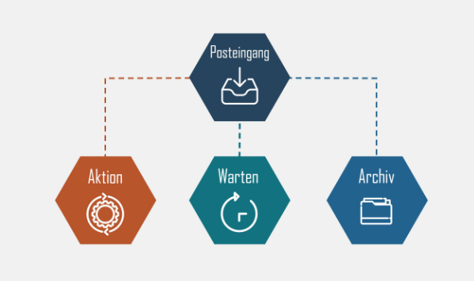

# Bericher der möglichen Überlastung
Wo Fühle ich mich überlaster. Teams muss nicht immer Online Sein Gibt es eine Pause Modus?

Timeboxing, wie viel ziet möchte ich für Welche Aufgabe vergeben. Mache Pausen und eine Timebox für Unvorhergesehenes.

## Batching

- Gewinnen Sie den Überblick und schreiben Sie eine To-Do-Liste mit allen Aufgaben (inkl. Routineaufgaben wie Bearbeiten von E-Mails).
- Bündeln Sie ähnliche Aktivitäten in Aufgabenpaketen.

## Timeboxing

- Legen Sie für das Erledigen jeder Aufgabe jeweils einen genau abgesteckten, realistischen Zeitblock fest.
- Verteilen Sie die Zeitblöcke auf Ihren Tag bzw. Ihre Woche.
- Planen Sie täglich eine Timebox für „Unvorhergesehens“ ein.

## Inbox Zero-Konzept

Dabei folgt die Bearbeitung der Mails diesen fünf Wegen:

- Mails, die innerhalb von weniger als 2 Minuten bearbeitet werden können
  - direkt bearbeiten
- Mails, für deren Bearbeitung mehr Zeit erforderlich ist
  - in den Unterordner „Aktion“ schieben, später beantworten
- Mails, die Sie zur weiteren Bearbeitung erst weiterleiten müssen
  - weiterleiten, anschließend in den Ordner „Warten“ ablegen
- Mails, die bereits bearbeitet sind, aber die Sie aufbewahren möchten
  - final in den Ordner „Archiv“ schieben
- Mails, die in keine der Kategorien fallen
  - in den Papierkorb
  
## Kernbotschften

1. Die digitale Informationsflut betrifft uns alle: Mehr als 60 % der Arbeitnehmer:innen fühlen sich von ihr zumindest zeitweise überlastet. Allerdings gibt es effektive Werkzeuge und Tools, die Informationen effektiv zu kanalisieren.
2.  Ein gut strukturiertes persönliches Informationsmanagement, striktes Monotasking und Ordnung im Postfach sorgen für einen entspannteren und zugleich konzentrierteren Arbeitsalltag.  
3.  Sich regelmäßig sogenannte Offline-Zeiten zu gönnen, kostet Überwindung, ist aber der Gesundheit zuträglich. Dabei können spezielle Apps zur Erfassung der Bildschirmzeiten oder zum Blockieren sozialer Netzwerke während bestimmter Zeitfenster sogar unterstützen.

## Workbook

[zum Workbook](Workbook_Digitale-Informationsflut.pdf)

